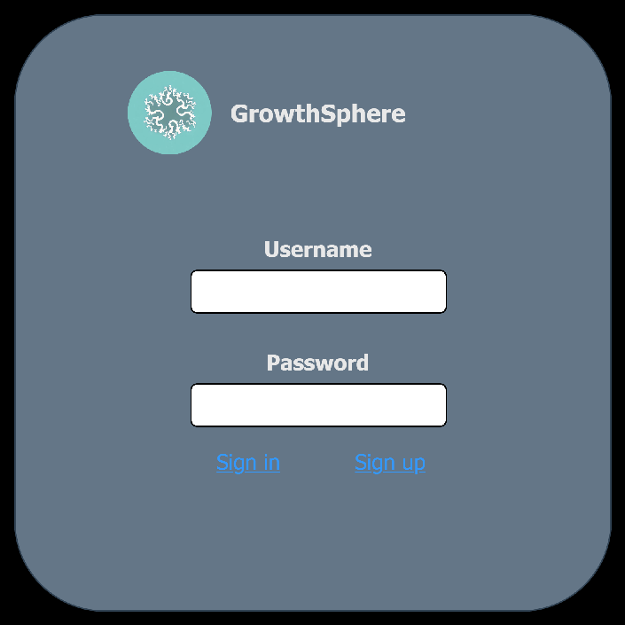
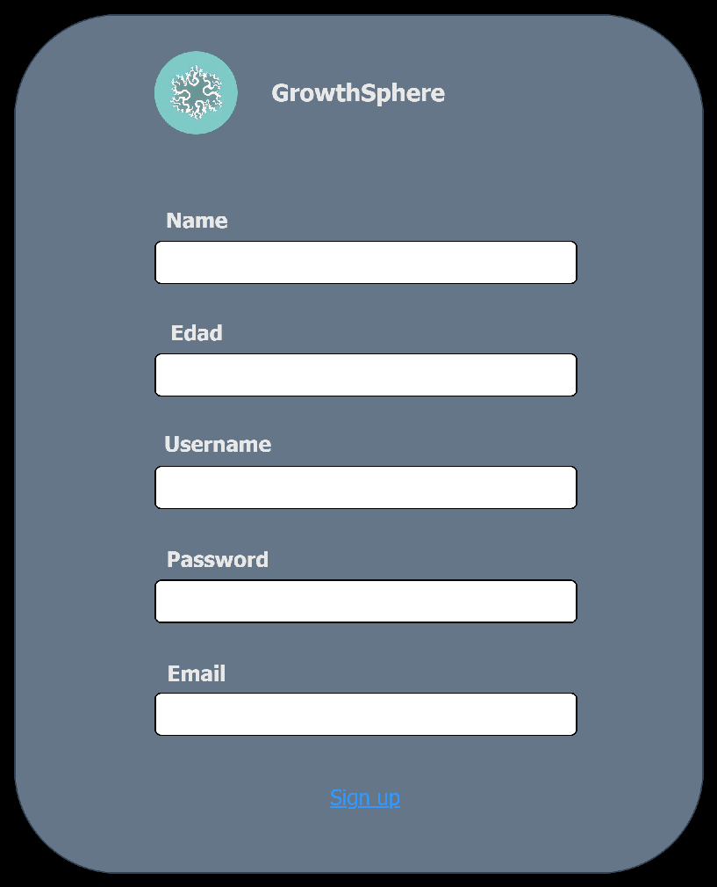
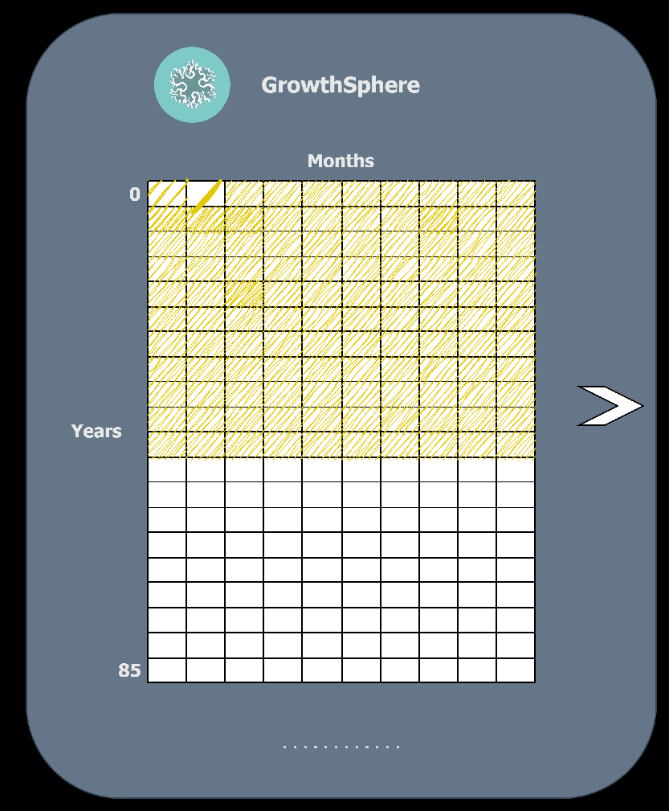
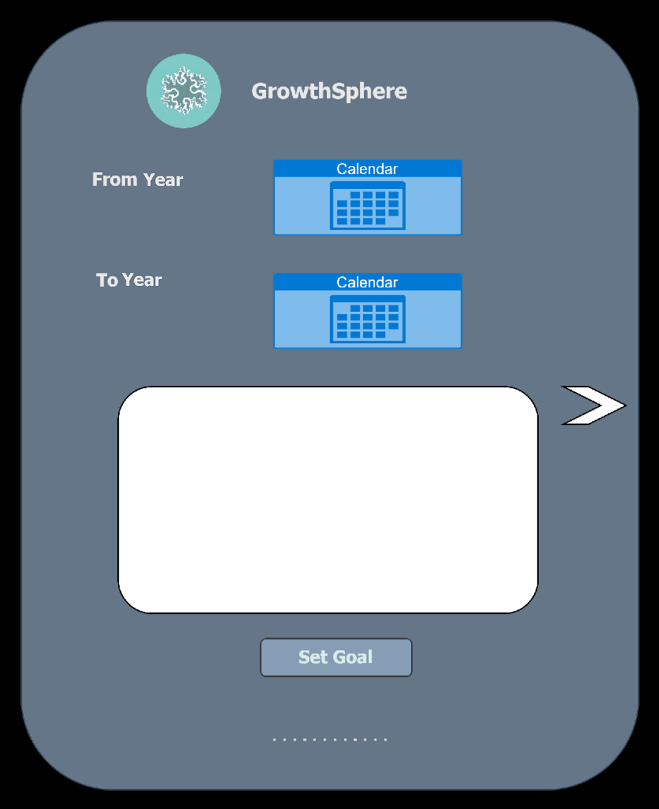
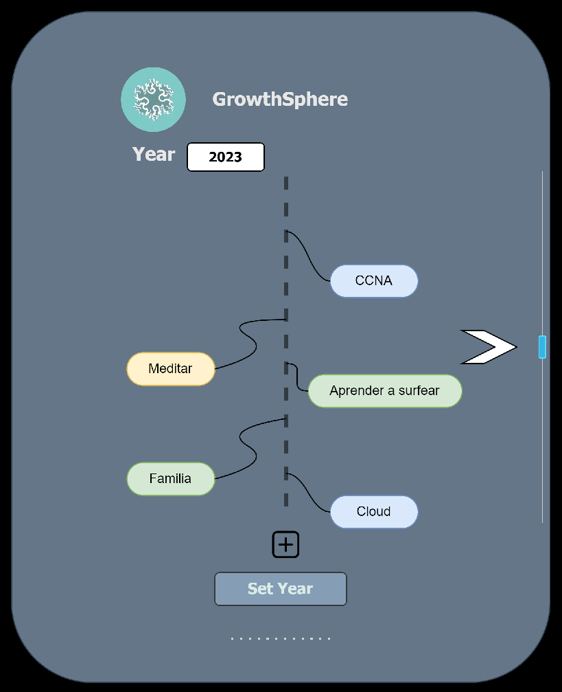
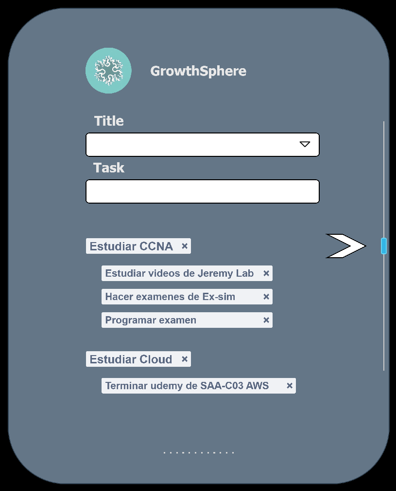
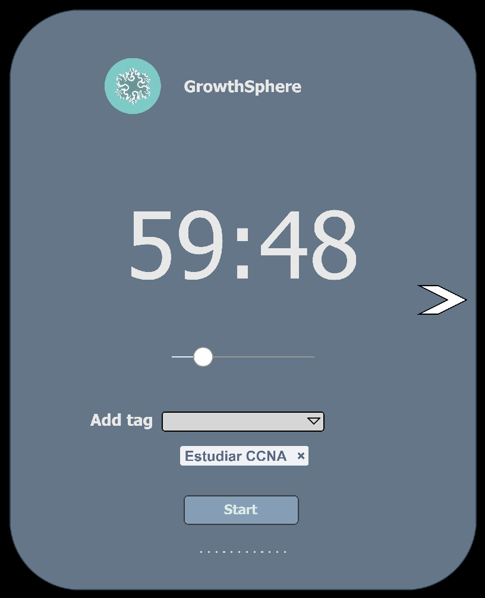
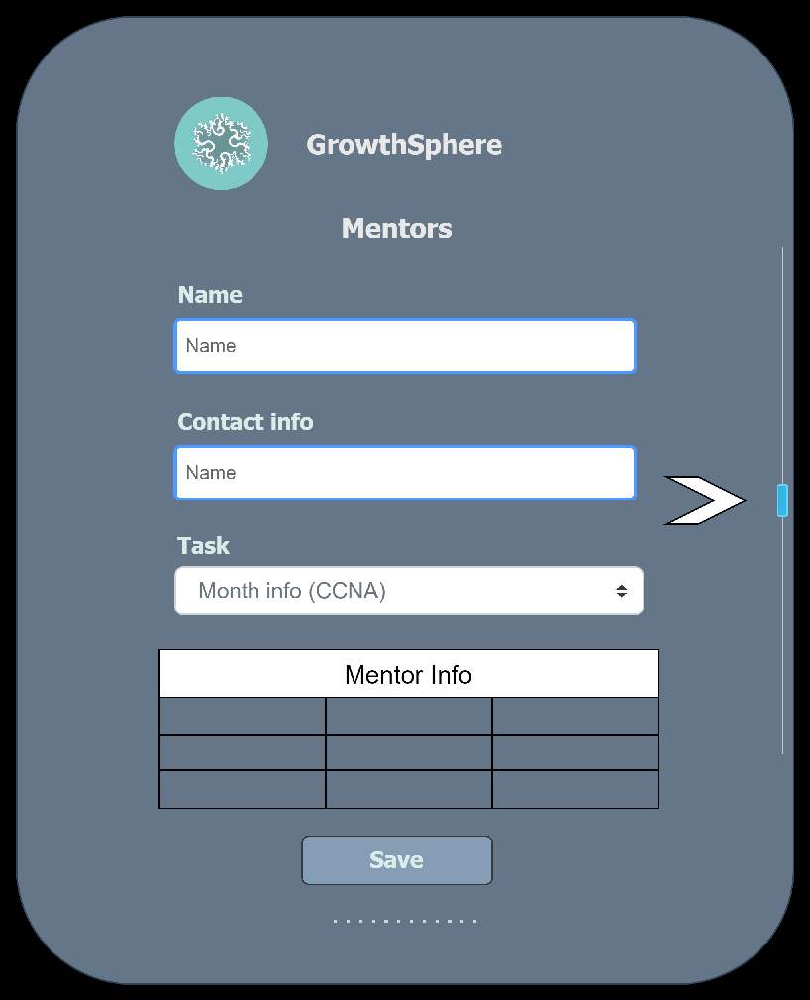

## Proyecto de CPP, QT, SQL
<br> 
La siguiente aplicacion tiene el nombre de GrowthSphere, esta aplicacion pone en perspectiva la vida de una persona en donde se puede planificar los objetivos y ver como cada dia nos vamos acercando al final de ella.
For running cmake:
```cpp
cmake.exe -S . -B . -G "MinGW Makefiles"
```
For building the sctipt
```cpp
mingw32-make
```
For running execute:
```cpp
GrowthSphere.exe
```
Se necesita tener una consola con las dependencias de Qt6
### 1. Autetificacion

<br>
Esta ventana se encarga de realizar a autentificacion del usuario con un usuario y una contraseña

### 2. Registrar usuario

<br>
Se realiza el registro de cada usuario con -> Nombre, Edad, Username, Password, Email
<br>
La informacion digitada debe ser asociada a cada usuario.

### 3. Matriz años de vida

<br>
Cada columna de la matriz representa los meses y las filas representan los años, es una manera de visualizar el tiempo de vida que nos queda. Esto podria ser una clase llamada **Vida** con atributos como -> goal_per_year, starting_time, ending_time, metas mesuales (heredadas del punto 5)

### 4. Proponer metas anuales

<br>
En esta ventana se hace el ingreso de la informacion esperada por la clase vida.

### 5. Proponer metas mensuales

<br>
Aca se proponen metas mensuales por cada año. Esta puede ser una clase llamada **MetasMesuales** con atributos como -> nombre_meta, tipo_meta (espiritual, salud, educacion), meses_en_ejecucion, tasks (se adquiere del punto 6)

### 6. Metas mensuales en tasks

<br>
Esta clase puede llevar atributos como nombre_meta y un vector de subtareas

### 7. Cronometro de estudio

<br>
Esta clase es un cronometro para concentrarse en cada una de las tareas a la vez y separar tiempo con tecnicas de estudio como la pomodoro

### 8. Tabla de mentores

<br>
Tabla para guardar los mentores adquiridos en cada tarea, aqui se puede crear una clase llamada **Mentor** con atributos -> name, contact_info, task_name.
